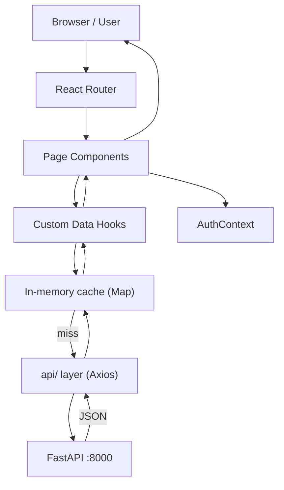

# Design Document: GenNews Frontend

## Overview

GenNews Frontend is a React + JavaScript single-page application that presents AI-powered news credibility data to users. It communicates exclusively with the GenNews FastAPI backend at `http://localhost:8000` and is structured around five primary pages: Home, Login, Category, News Article detail, and Publisher detail.

The application is designed around two authentication states:
- **Unauthenticated**: Full news browsing access; dashboard metrics are locked behind a sign-in prompt
- **Authenticated**: Full access including platform statistics dashboard

Key design goals:
- Fast client-side navigation with React Router
- Responsive layout from 320px to 1920px
- Accessible, keyboard-navigable UI
- Minimal redundant API calls via a simple in-memory cache layer

### Tech Stack

| Concern | Choice | Rationale |
|---|---|---|
| UI Framework | React 18 + JavaScript | Lightweight, no compile step for types, fast iteration |
| Routing | React Router v6 | Declarative client-side routing, nested routes |
| Styling | Tailwind CSS | Utility-first, responsive breakpoints built-in |
| HTTP Client | Axios | Interceptors for global error handling, easy base URL config |
| State Management | React Context + `useReducer` | Sufficient for auth state and global UI; avoids Redux overhead |
| Data Fetching | Custom hooks wrapping Axios | Co-located loading/error state, simple cache |
| Build Tool | Vite | Fast HMR, minimal config |
| Testing | Vitest + React Testing Library + fast-check | Unit, integration, and property-based tests |

---

## Architecture

### High-Level Structure

```
src/
├── api/                  # Axios instance + API functions
│   ├── client.js         # Axios base config + interceptors
│   ├── articles.js
│   ├── clusters.js
│   ├── publishers.js
│   └── stats.js
├── components/           # Shared/reusable UI components
│   ├── layout/
│   │   ├── AppShell.jsx      # Root layout: Sidebar + TopNav + <Outlet>
│   │   ├── Sidebar.jsx
│   │   ├── TopNav.jsx
│   │   └── MobileMenu.jsx
│   ├── article/
│   │   ├── ArticleCard.jsx
│   │   ├── CredibilityBadge.jsx
│   │   ├── RiskTag.jsx
│   │   └── ArticleList.jsx
│   ├── dashboard/
│   │   ├── DashboardPanel.jsx
│   │   └── DashboardLocked.jsx
│   ├── news/
│   │   ├── CoverageMap.jsx
│   │   ├── NarrativePanel.jsx
│   │   ├── LLMAnalysisPanel.jsx
│   │   └── CredibilityBreakdown.jsx
│   └── common/
│       ├── LoadingSkeleton.jsx
│       ├── ErrorState.jsx
│       └── EmptyState.jsx
├── pages/
│   ├── HomePage.jsx
│   ├── LoginPage.jsx
│   ├── CategoryPage.jsx
│   ├── NewsPage.jsx
│   ├── PublisherPage.jsx
│   ├── AnalyzePage.jsx
│   └── NotFoundPage.jsx
├── hooks/
│   ├── useArticles.js
│   ├── useArticle.js
│   ├── useCluster.js
│   ├── usePublisher.js
│   ├── useStats.js
│   └── useInfiniteScroll.js
├── context/
│   └── AuthContext.jsx    # Auth state + login/logout actions
└── utils/
    ├── credibility.js     # Score → color/label helpers
    └── validation.js      # Form validation helpers
```

### Routing Structure

```
/                          → HomePage (AppShell wrapper)
/login                     → LoginPage (no AppShell)
/category/:categoryName    → CategoryPage
/articles/:id              → NewsPage
/publishers/:id            → PublisherPage
/analyze                   → AnalyzePage
*                          → NotFoundPage
```

### Data Flow



---

## Components and Interfaces

### AppShell

Wraps every authenticated/public page. Renders `<TopNav>`, `<Sidebar>`, and `<Outlet>` (React Router). Handles responsive collapse of the sidebar at `< 768px`.

```
Props: none (reads AuthContext internally)
Layout: CSS Grid — sidebar (fixed 260px) | main content (flex-grow)
Mobile: sidebar hidden by default, toggled via hamburger in TopNav
```

### TopNav

```
Props: none
Renders:
  - Left: GenNews logo (links to /)
  - Right: <LoginButton> if unauthenticated | <UserIndicator> if authenticated
```

### Sidebar

```
Props: none
Sections:
  1. DashboardPanel (or DashboardLocked)
  2. CategoryList — 8 categories, each a NavLink to /category/:name
     - Active category highlighted via NavLink activeClassName
     - Hover highlight via Tailwind hover: utilities
```

### DashboardPanel / DashboardLocked

```
DashboardLocked:
  - Lock icon + "Sign in to start the metrics" text
  - "Login" link → /login

DashboardPanel (authenticated):
  - Fetches GET /api/stats on mount
  - Displays: articles_analyzed, active_clusters, tracked_publishers
  - Loading skeleton while fetching
  - Error state with retry button on failure
```

### ArticleCard

```
Props:
  article: ArticleSummary

Renders:
  - Title (link to /articles/:id)
  - Publisher name (link to /publishers/:id) + reputation score badge
  - Publication timestamp (relative, e.g. "2h ago")
  - Category label pill
  - CredibilityBadge

Accessibility: article role, descriptive aria-labels on badge
```

### CredibilityBadge

```
Props:
  score: number        // 0.0–1.0
  verdict: string      // "Likely Credible" | "Needs Verification" | "Potentially Unreliable"

Color encoding:
  score >= 0.7  → green  (bg-green-100 text-green-800)
  score >= 0.3  → yellow (bg-yellow-100 text-yellow-800)
  score < 0.3   → red    (bg-red-100 text-red-800)

Accessibility: aria-label="Credibility: {verdict} ({score})"
  — conveys meaning via text, not color alone
```

### CoverageMap

```
Props:
  cluster: ClusterDetail

Renders:
  - Total source count header
  - List of publishers with reputation badge
  - Original source visually distinguished (star icon + "Original Source" label)
  - "No cluster data available" empty state when cluster is null
```

### NarrativePanel

```
Props:
  cluster: ClusterDetail

Renders:
  - Per-publisher rows: publisher name, tone badge, key claims list
  - Claims present in some but not all articles highlighted (yellow background)
  - Clicking publisher name navigates to /articles/:articleId for that publisher's article
```

### LLMAnalysisPanel

```
Props:
  llmAnalysis: LLMAnalysis | null

Renders:
  - Key claims list
  - Narrative framing paragraph
  - Emotional tone badge
  - Bias indicators list (hidden if empty)
  - "Analysis unavailable" message when llmAnalysis is null
```

### CredibilityBreakdown

```
Props:
  article: ArticleDetail

Renders:
  - Publisher reputation contribution
  - Misinformation risk contribution
  - Source diversity (matching sources count)
  - Single-source penalty notice (conditional)
  - Risk tags with plain-language explanations
```

### AnalyzeForm

```
State: { text, title, url, publisherName, loading, error, result }

Validation:
  - text must be non-empty (non-whitespace)
  - url must be valid URL format if provided

On submit: POST /api/articles/analyze
  - Disables submit button + shows spinner while in-flight
  - Renders full analysis result on success
  - Renders descriptive error on failure
```

---

## Data Models

JavaScript object shapes mirroring the Backend API responses (documented with JSDoc for editor hints):

```js
// utils/apiShapes.js — JSDoc shape documentation

/**
 * @typedef {Object} ArticleSummary
 * @property {number} id
 * @property {string} title
 * @property {string} publisher_name
 * @property {number} publisher_id
 * @property {string} published_at  // ISO 8601
 * @property {string} category
 * @property {number} credibility_score
 * @property {string} verdict
 * @property {string[]} risk_indicators
 * @property {number} publisher_reputation
 */

/**
 * @typedef {Object} LLMAnalysis
 * @property {string[]} claims
 * @property {string} framing
 * @property {string} tone
 * @property {string[]} bias_indicators
 */

/**
 * @typedef {ArticleSummary & Object} ArticleDetail
 * @property {string} cleaned_text
 * @property {string[]} keywords
 * @property {number} misinfo_risk_score
 * @property {string[]} misinfo_indicators
 * @property {boolean} is_high_risk
 * @property {LLMAnalysis|null} llm_analysis
 * @property {number|null} cluster_id
 * @property {number} matching_sources
 * @property {number} confidence
 */

/**
 * @typedef {Object} ClusterPublisher
 * @property {number} publisher_id
 * @property {string} publisher_name
 * @property {number} article_id
 * @property {number} reputation_score
 * @property {string} tone
 * @property {string[]} claims
 * @property {boolean} is_original_source
 */

/**
 * @typedef {Object} ClusterDetail
 * @property {number} id
 * @property {number} total_sources
 * @property {ClusterPublisher[]} publishers
 */

/**
 * @typedef {Object} PlatformStats
 * @property {number} articles_analyzed
 * @property {number} active_clusters
 * @property {number} tracked_publishers
 */

/**
 * @typedef {Object} PublisherDetail
 * @property {number} id
 * @property {string} name
 * @property {number} reputation_score
 * @property {number} total_articles
 * @property {ArticleSummary[]} recent_articles
 */
```

### API Layer (`api/client.js`)

```js
// Axios instance with base URL and auth interceptor
const client = axios.create({ baseURL: 'http://localhost:8000' });

// Request interceptor: attach Bearer token if present
client.interceptors.request.use(config => {
  const token = localStorage.getItem('token');
  if (token) config.headers.Authorization = `Bearer ${token}`;
  return config;
});

// Response interceptor: normalize errors
client.interceptors.response.use(
  res => res,
  err => Promise.reject(normalizeError(err))
);
```

### Simple Cache

```js
// hooks/cache.js — module-level Map, cleared on logout
const cache = new Map();
const TTL = 60_000; // 1 minute

export function getCached(key) { ... }
export function setCached(key, data) { ... }
export function clearCache() { cache.clear(); }
```

### Auth Context

```jsx
// context/AuthContext.jsx
// Provides: { auth, login, logout }
// auth shape: { isAuthenticated: bool, user: { email } | null, token: string | null }
```

Login calls `POST /api/auth/login`, stores the token in `localStorage`, and updates context state. Logout clears token and cache.

---

## Correctness Properties

*A property is a characteristic or behavior that should hold true across all valid executions of a system — essentially, a formal statement about what the system should do. Properties serve as the bridge between human-readable specifications and machine-verifiable correctness guarantees.*

### Property 1: ArticleCard renders all required fields

*For any* article summary object, the rendered ArticleCard should contain the article title, publisher name, publication timestamp, category label, credibility score, verdict, and publisher reputation score.

**Validates: Requirements 5.4, 14.1**

---

### Property 2: CredibilityBadge color encoding

*For any* credibility score value in [0.0, 1.0], the `getCredibilityColor` helper should return green for scores ≥ 0.7, yellow for scores in [0.3, 0.7), and red for scores < 0.3. The same thresholds apply to publisher reputation scores.

**Validates: Requirements 9.5, 14.3**

---

### Property 3: CredibilityBadge accessibility

*For any* credibility score and verdict, the rendered CredibilityBadge should have an `aria-label` that includes both the verdict text and the numeric score, so that the meaning is conveyed independently of color.

**Validates: Requirements 20.4**

---

### Property 4: News_Page renders all article metadata

*For any* article detail object, the rendered News_Page should display the title, publisher name, publication timestamp, category, cleaned text, credibility score, verdict, misinformation risk score, and all risk indicators.

**Validates: Requirements 9.2, 9.3, 9.4, 9.6, 9.7**

---

### Property 5: LLMAnalysisPanel renders all analysis fields

*For any* article with a non-null `llm_analysis`, the rendered LLMAnalysisPanel should display all claims, the framing description, the emotional tone, and all bias indicators (when non-empty).

**Validates: Requirements 10.2, 10.3, 10.4, 10.5**

---

### Property 6: CoverageMap renders all cluster publishers

*For any* cluster detail object, the rendered CoverageMap should display an entry for every publisher in `cluster.publishers`, each showing the publisher name, reputation score, and a distinguishing marker for the publisher where `is_original_source` is true. The total source count should match `cluster.total_sources`.

**Validates: Requirements 11.2, 11.3, 11.4, 11.5**

---

### Property 7: NarrativePanel renders publisher claims and tone

*For any* cluster detail object, the rendered NarrativePanel should display an entry for every publisher containing their claims list and emotional tone. Claims that appear in fewer than all articles in the cluster should be visually marked as divergent.

**Validates: Requirements 12.2, 12.3, 12.4**

---

### Property 8: CredibilityBreakdown renders all score components

*For any* article detail object, the rendered CredibilityBreakdown should display the publisher reputation contribution, misinformation risk contribution, and source diversity (matching sources count). When `risk_indicators` includes "Single Source", a penalty notice should be present.

**Validates: Requirements 15.2, 15.3, 15.4, 15.5**

---

### Property 9: Filter parameters propagate to API calls

*For any* combination of category, publisher, and credibility risk level filter values applied on the Home_Page, the resulting GET /api/articles request should include query parameters that exactly reflect the selected filter values.

**Validates: Requirements 6.2**

---

### Property 10: Dashboard stats renders all platform metrics

*For any* platform stats object returned by GET /api/stats, the rendered DashboardPanel should display all three values: `articles_analyzed`, `active_clusters`, and `tracked_publishers`.

**Validates: Requirements 4.2, 4.3, 4.4**

---

### Property 11: Login form rejects invalid email formats

*For any* string that does not conform to a valid email format (i.e., does not match the pattern `[non-empty]@[non-empty].[non-empty]`), submitting the login form should display a validation error and not invoke the login API.

**Validates: Requirements 7.5**

---

### Property 12: Analyze form rejects whitespace-only text

*For any* string composed entirely of whitespace characters (spaces, tabs, newlines), submitting the Analyze_Form should display a validation error and not invoke POST /api/articles/analyze.

**Validates: Requirements 13.5**

---

### Property 13: Analyze result renders all response fields

*For any* successful analyze response from the backend, the rendered result should display the credibility score, verdict, all risk indicators, all LLM claims, and the matching sources count.

**Validates: Requirements 13.4**

---

### Property 14: API error states are always shown

*For any* HTTP error response (4xx or 5xx status) from the Backend_API, the Frontend_App should render a user-visible error message rather than an empty or broken layout.

**Validates: Requirements 17.1, 17.4**

---

### Property 15: Publisher detail renders all required fields

*For any* publisher detail object, the rendered PublisherPage should display the publisher's reputation score, total articles tracked, and a list of recent articles.

**Validates: Requirements 14.5**

---

### Property 16: Form inputs have associated labels

*For any* form rendered by the Frontend_App (Login form, Analyze form), every `<input>` and `<textarea>` element should have an associated `<label>` via `htmlFor`/`id` pairing or `aria-labelledby`.

**Validates: Requirements 20.3**

---

### Property 17: Category heading matches route parameter

*For any* category name used as a route parameter in `/category/:categoryName`, the rendered Category_Page heading should display that exact category name.

**Validates: Requirements 8.2**

---

## Error Handling

### Strategy

All API calls go through the Axios instance in `api/client.ts`. The response interceptor normalizes errors into a consistent `AppError` shape:

```js
// Normalized error shape returned by the response interceptor
// { status: number|null, message: string, retryable: boolean }
function normalizeError(err) {
  return {
    status: err.response?.status ?? null,
    message: err.response?.data?.detail ?? 'Something went wrong',
    retryable: !err.response || err.response.status >= 500,
  };
}
```

### Error Scenarios

| Scenario | Behavior |
|---|---|
| Network unreachable | `<ErrorState>` with "Unable to connect" message + Retry button |
| 404 on article detail | "Article not found" message + link to Home_Page |
| 404 on publisher detail | "Publisher not found" message + link to Home_Page |
| 4xx on login | Inline error below form, no navigation |
| 5xx on any fetch | `<ErrorState>` with generic "Something went wrong" + Retry button |
| Empty article list | `<EmptyState>` with "No articles found" message |
| Empty category | `<EmptyState>` with "No articles in this category" message |
| LLM analysis null | "Analysis unavailable for this article" in LLMAnalysisPanel |
| No cluster data | "No cluster data available" in place of CoverageMap/NarrativePanel |

### Loading States

Every data-fetching hook returns `{ data, loading, error }`. Components render:
- `<LoadingSkeleton>` while `loading === true`
- `<ErrorState>` when `error !== null`
- Content when `data !== null`

This ensures no page ever renders a blank or broken layout.

### Retry Mechanism

`<ErrorState>` accepts an optional `onRetry` callback. When provided, a "Try again" button is shown. Hooks expose a `refetch()` function that clears the error and re-issues the request.

---

## Testing Strategy

### Dual Testing Approach

Both unit/integration tests and property-based tests are required. They are complementary:

- **Unit/integration tests** (Vitest + React Testing Library): verify specific examples, edge cases, error conditions, and component rendering
- **Property-based tests** (Vitest + fast-check): verify universal properties across randomly generated inputs

### Unit / Integration Tests

Focus areas:
- Page-level rendering with mocked API responses (happy path + error path)
- Navigation: clicking Article_Cards, publisher names, category links
- Auth state transitions: login success, login failure, logout
- Conditional rendering: locked dashboard vs. authenticated dashboard, cluster present vs. absent, LLM analysis present vs. absent
- Form validation: empty password, invalid email, whitespace-only analyze text
- Pagination: scroll-to-bottom triggers next page fetch

Avoid writing unit tests for behaviors already covered by property tests.

### Property-Based Tests (fast-check)

Each property from the Correctness Properties section must be implemented as a single property-based test using `fast-check`. Minimum 100 iterations per test.

Tag format for each test:
```
// Feature: gennews-frontend, Property {N}: {property_text}
```

| Property | Generator Strategy |
|---|---|
| P1: ArticleCard fields | `fc.record({ id, title, publisher_name, ... })` with arbitrary strings/numbers |
| P2: CredibilityBadge color | `fc.float({ min: 0, max: 1 })` — test all three threshold regions |
| P3: CredibilityBadge aria-label | `fc.tuple(fc.float({ min: 0, max: 1 }), fc.constantFrom(...verdicts))` |
| P4: News_Page metadata | `fc.record(ArticleDetail shape)` |
| P5: LLMAnalysisPanel fields | `fc.record(LLMAnalysis shape)` with `fc.array(fc.string())` for claims/bias |
| P6: CoverageMap publishers | `fc.record(ClusterDetail shape)` with `fc.array(ClusterPublisher)` |
| P7: NarrativePanel claims | `fc.record(ClusterDetail shape)` with overlapping/non-overlapping claim arrays |
| P8: CredibilityBreakdown | `fc.record(ArticleDetail shape)` with optional "Single Source" in risk_indicators |
| P9: Filter params | `fc.record({ category, publisher, riskLevel })` with arbitrary filter values |
| P10: Dashboard stats | `fc.record(PlatformStats shape)` |
| P11: Login email validation | `fc.string()` filtered to non-email-format strings |
| P12: Analyze whitespace | `fc.stringOf(fc.constantFrom(' ', '\t', '\n'))` |
| P13: Analyze result fields | `fc.record(AnalyzeResult shape)` |
| P14: API error states | `fc.integer({ min: 400, max: 599 })` for status codes |
| P15: Publisher detail fields | `fc.record(PublisherDetail shape)` |
| P16: Form label association | Render each form and assert label-input pairing |
| P17: Category heading | `fc.constantFrom(...categoryNames)` |

### Test File Structure

```
src/
├── __tests__/
│   ├── components/
│   │   ├── ArticleCard.test.jsx       # P1, unit examples
│   │   ├── CredibilityBadge.test.jsx  # P2, P3, unit examples
│   │   ├── DashboardPanel.test.jsx    # P10, unit examples
│   │   ├── CoverageMap.test.jsx       # P6, unit examples
│   │   ├── NarrativePanel.test.jsx    # P7, unit examples
│   │   ├── LLMAnalysisPanel.test.jsx  # P5, unit examples
│   │   └── CredibilityBreakdown.test.jsx # P8, unit examples
│   ├── pages/
│   │   ├── HomePage.test.jsx          # P9, unit examples
│   │   ├── LoginPage.test.jsx         # P11, unit examples
│   │   ├── NewsPage.test.jsx          # P4, P14, unit examples
│   │   ├── CategoryPage.test.jsx      # P17, unit examples
│   │   ├── PublisherPage.test.jsx     # P15, unit examples
│   │   └── AnalyzePage.test.jsx       # P12, P13, unit examples
│   └── utils/
│       └── credibility.test.js        # P2 pure function tests
```

### Property Test Configuration

```js
// vite.config.js
export default defineConfig({
  test: {
    globals: true,
    environment: 'jsdom',
    setupFiles: ['./src/test-setup.js'],
  }
});
```

Each property test runs with `fc.assert(fc.property(...), { numRuns: 100 })` minimum.
