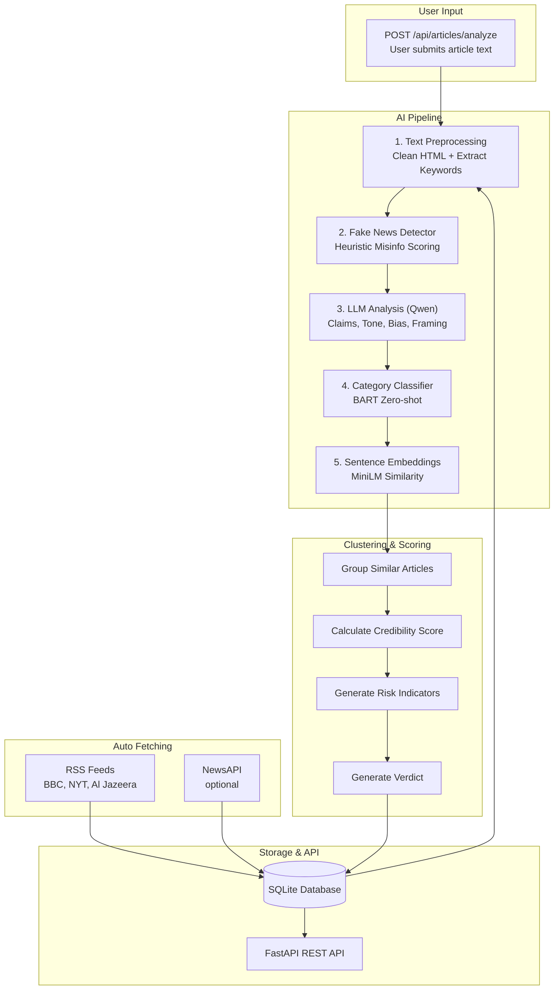

# GenNews Backend — Complete Walkthrough

## Overview

GenNews is an AI-powered news credibility platform. The backend fetches news from RSS feeds, runs AI analysis (categorization, misinformation detection, LLM deep analysis), clusters related articles, calculates credibility scores, and lets users **submit their own articles** for analysis.

---

## How It Works (Data Flow)



---

## The Key Endpoint: Submit an Article

### `POST /api/articles/analyze`

This is the main endpoint for checking news credibility. A user pastes article text and gets back a full analysis.

**Request:**
```json
{
  "text": "The full article text to analyze...",
  "title": "Optional title",
  "url": "https://optional-source-url.com",
  "publisher_name": "Optional publisher name"
}
```

**Response (what you get back):**
```json
{
  "article_id": 93,
  "title": "Article title",
  "publisher_name": "User Submitted",
  "cleaned_text": "Cleaned article text...",
  "keywords": ["keyword1", "keyword2", "keyword3"],
  "category": { "category": "politics", "confidence": 0.87 },
  "misinfo_risk_score": 0.35,
  "misinfo_indicators": ["sensational_language"],
  "is_high_risk": false,
  "llm_analysis": {
    "claims": ["Claim 1", "Claim 2"],
    "framing": "The article frames this as...",
    "tone": "neutral",
    "bias_indicators": []
  },
  "cluster_id": 5,
  "credibility_score": 0.72,
  "matching_sources": 3,
  "risk_indicators": [],
  "verdict": "Needs Verification",
  "confidence": 0.56
}
```

### Verdict Logic

| Condition | Verdict | Meaning |
|---|---|---|
| Risk < 0.3 AND 2+ matching sources | **Likely Credible** ✅ | Low misinfo risk, confirmed by multiple sources |
| Risk < 0.7 | **Needs Verification** ⚠️ | Some risk indicators, check other sources |
| Risk ≥ 0.7 | **Potentially Unreliable** 🔴 | High misinfo risk, treat with caution |

---

## All API Endpoints

| Endpoint | Method | Description |
|---|---|---|
| `/` | GET | API info |
| **`/api/articles/analyze`** | **POST** | **Submit article text for credibility analysis** |
| `/api/articles` | GET | List articles (filter by category, publisher, date, risk) |
| `/api/articles/{id}` | GET | Full article detail with all AI analysis |
| `/api/clusters` | GET | List story clusters |
| `/api/clusters/{id}` | GET | Cluster detail with coverage map + narrative diffs |
| `/api/publishers` | GET | List publishers with reputation scores |
| `/api/publishers/{id}` | GET | Publisher detail with recent articles |
| `/api/health` | GET | System health (DB, Ollama, Scheduler) |
| `/api/stats` | GET | Platform statistics |
| `/api/fetch` | POST | Manually trigger RSS fetch cycle |
| `/docs` | GET | Swagger UI (interactive docs) |

---

## AI Pipeline — What Happens to Each Article

### Stage 1: Text Preprocessing ([text_preprocessor.py](file:///c:/Farzi/Hackathon_Jims/backend/services/text_preprocessor.py))
- Strips HTML tags, normalizes whitespace
- Extracts top 15 keywords with TF-IDF

### Stage 2: Fake News Detection ([fake_news_detector.py](file:///c:/Farzi/Hackathon_Jims/backend/services/fake_news_detector.py))
Heuristic scoring with three components:

| Component | Weight | Checks |
|---|---|---|
| Sensationalism | 40% | Clickbait, excessive caps, exclamation marks |
| Source Citations | 35% | "According to", named sources, quotes |
| Logical Consistency | 25% | Contradictions, vague attributions |

→ Returns `risk_score` (0.0–1.0), [indicators](file:///c:/Farzi/Hackathon_Jims/backend/services/credibility_engine.py#121-178), `is_high_risk`

### Stage 3: LLM Analysis ([llm_analyzer.py](file:///c:/Farzi/Hackathon_Jims/backend/services/llm_analyzer.py))
- Calls **Qwen 2.5 via Ollama** locally
- Extracts: key claims, narrative framing, emotional tone, bias indicators
- 30-second timeout with graceful fallback

### Stage 4: Category Classification ([category_classifier.py](file:///c:/Farzi/Hackathon_Jims/backend/services/category_classifier.py))
- **BART-large-MNLI** zero-shot classifier (~1.6 GB, runs on CPU)
- Categories: politics, technology, health, business, sports, entertainment, science, world news

### Stage 5: Embedding + Clustering ([similarity_engine.py](file:///c:/Farzi/Hackathon_Jims/backend/services/similarity_engine.py) + [news_clusterer.py](file:///c:/Farzi/Hackathon_Jims/backend/services/news_clusterer.py))
- **all-MiniLM-L6-v2** generates 384-dim embeddings (~80 MB)
- Cosine similarity to find related articles (threshold: 0.75)
- Groups into story clusters; identifies the original source

---

## Credibility Scoring Formula

```
score = (publisher_reputation × 0.30)
      + (1 - avg_misinfo_risk × 0.30)
      + (source_diversity × 0.25)
      + (claim_consistency × 0.15)

if single_source: score × 0.7  (30% penalty)
```

**Risk Indicators** generated per cluster:
- 🔴 **Single Source** — only one publisher reports the story
- 🟡 **Low Publisher Reputation** — average reputation < 0.4
- 🔴 **High Misinformation Risk** — articles exceed 0.7 threshold
- 🟡 **Narrative Inconsistency** — 3+ different tones across sources

---

## AI Models Used

| Model | Purpose | Size | Cost |
|---|---|---|---|
| **Qwen 2.5** (Ollama) | Claims, tone, bias analysis | Your install | Free |
| **BART-large-MNLI** (HuggingFace) | Category classification | ~1.6 GB | Free |
| **all-MiniLM-L6-v2** (HuggingFace) | Article similarity | ~80 MB | Free |

All models run **locally on CPU** — no cloud APIs, no cost.

---

## File Structure

```
backend/
├── main.py                    # FastAPI app + startup
├── config.py                  # Settings from .env
├── database.py                # SQLAlchemy (SQLite)
├── models.py                  # Article, Cluster, Publisher, FetchLog
├── schemas.py                 # Pydantic request/response models
├── .env                       # Environment config
├── requirements.txt           # Dependencies
├── services/
│   ├── text_preprocessor.py   # HTML cleaning + TF-IDF keywords
│   ├── category_classifier.py # BART zero-shot classification
│   ├── fake_news_detector.py  # Heuristic misinfo scoring
│   ├── llm_analyzer.py        # Qwen via Ollama
│   ├── similarity_engine.py   # Sentence embeddings
│   ├── news_clusterer.py      # Story clustering
│   ├── credibility_engine.py  # Score calculation + risk flags
│   ├── pipeline.py            # Pipeline orchestrator
│   ├── news_fetcher.py        # RSS + NewsAPI fetching
│   └── scheduler.py           # APScheduler background tasks
└── routers/
    ├── articles.py            # Articles + analyze endpoint
    ├── clusters.py            # Story clusters
    ├── publishers.py          # Publisher reputation
    └── health.py              # Health + stats + manual fetch
```

---

## Verification Results

| Test | Result |
|---|---|
| Server starts | ✅ Running on port 8000 |
| `GET /api/health` | ✅ DB healthy, Ollama healthy, Scheduler running |
| `POST /api/fetch` | ✅ Fetched 92 articles from 3 publishers (NYT, BBC, Al Jazeera) |
| `GET /api/articles` | ✅ Returns paginated articles |
| `GET /api/publishers` | ✅ Shows 3 publishers with reputation scores |
| Swagger UI `/docs` | ✅ All endpoints documented |


---

## How to Run

```bash
cd c:\Farzi\Hackathon_Jims\backend
python -W ignore -m uvicorn main:app --host 0.0.0.0 --port 8000
```

Then open **http://localhost:8000/docs** to test the API interactively.
