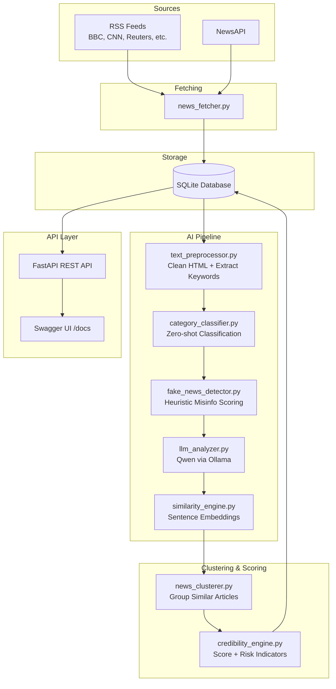

# GenNews Backend — Complete Walkthrough

## Overview

GenNews is an AI-powered news credibility platform. The backend aggregates news from RSS feeds and NewsAPI, runs each article through an AI analysis pipeline (categorization, misinformation detection, LLM deep analysis), groups similar articles into story clusters, calculates credibility scores, and exposes everything through a REST API.

---

## Architecture



---

## File-by-File Breakdown

### Core Files

#### [config.py](file:///c:/Farzi/Hackathon_Jims/backend/config.py)
Loads all settings from the [.env](file:///c:/Farzi/Hackathon_Jims/backend/.env) file:
- **`OLLAMA_BASE_URL`** / **`OLLAMA_MODEL`** — where to find your local Qwen model
- **`NEWS_API_KEY`** — optional NewsAPI key
- **`RSS_FEEDS`** — comma-separated list of RSS feed URLs
- **`FETCH_INTERVAL_HOURS`** — how often the scheduler runs (default 12h)
- AI thresholds: similarity (0.75), misinfo high-risk (0.7), category confidence (0.6)

#### [database.py](file:///c:/Farzi/Hackathon_Jims/backend/database.py)
Sets up a **synchronous SQLAlchemy** engine with SQLite. Creates a `SessionLocal` factory for database sessions. The [get_db()](file:///c:/Farzi/Hackathon_Jims/backend/database.py#24-31) function is a FastAPI dependency that provides a session per request.

> [!NOTE]
> We use sync SQLAlchemy (not async) because `greenlet` — required for async — cannot compile on Python 3.13 Windows.

#### [models.py](file:///c:/Farzi/Hackathon_Jims/backend/models.py)
Four ORM models map to database tables:

| Model | Purpose | Key Fields |
|---|---|---|
| **Article** | A single news article | title, url, publisher, cleaned_text, category (JSON), misinfo_risk_score, llm_analysis (JSON), embedding (binary), cluster_id |
| **StoryCluster** | Group of articles about the same event | title, credibility_score, risk_indicators (JSON), original_source_id |
| **Publisher** | A news source with reputation tracking | name, reputation_score, article_count |
| **FetchLog** | Record of each fetch cycle | started_at, completed_at, articles_fetched, errors_count |

#### [schemas.py](file:///c:/Farzi/Hackathon_Jims/backend/schemas.py)
Pydantic models that define the shape of all API responses — [ArticleSummary](file:///c:/Farzi/Hackathon_Jims/backend/schemas.py#23-38), [ArticleDetail](file:///c:/Farzi/Hackathon_Jims/backend/schemas.py#40-63), [ClusterSummary](file:///c:/Farzi/Hackathon_Jims/backend/schemas.py#72-85), [ClusterDetail](file:///c:/Farzi/Hackathon_Jims/backend/schemas.py#87-102) (with coverage_map and narrative_differences), [PublisherSummary](file:///c:/Farzi/Hackathon_Jims/backend/schemas.py#106-114), [PublisherDetail](file:///c:/Farzi/Hackathon_Jims/backend/schemas.py#116-126), [HealthCheck](file:///c:/Farzi/Hackathon_Jims/backend/schemas.py#138-146), [PaginatedResponse](file:///c:/Farzi/Hackathon_Jims/backend/schemas.py#130-136).

---

### Services (The AI Pipeline)

The pipeline processes each article through 5 stages, then clusters and scores.

#### Stage 1: [text_preprocessor.py](file:///c:/Farzi/Hackathon_Jims/backend/services/text_preprocessor.py)
- **[clean_text()](file:///c:/Farzi/Hackathon_Jims/backend/services/text_preprocessor.py#14-30)** — Strips HTML tags using BeautifulSoup, normalizes whitespace and encoding
- **[extract_keywords()](file:///c:/Farzi/Hackathon_Jims/backend/services/text_preprocessor.py#32-51)** — Uses scikit-learn's `TfidfVectorizer` to find the top 15 keywords

#### Stage 2: [category_classifier.py](file:///c:/Farzi/Hackathon_Jims/backend/services/category_classifier.py)
- Uses **HuggingFace `facebook/bart-large-mnli`** (~1.6 GB, downloaded once, runs on CPU)
- Zero-shot classification into 8 categories: politics, technology, health, business, sports, entertainment, science, world news
- Returns `{category, confidence, is_uncertain}` — marks as uncertain if confidence < 0.6

#### Stage 3: [fake_news_detector.py](file:///c:/Farzi/Hackathon_Jims/backend/services/fake_news_detector.py)
Heuristic-based analysis with three scoring components:

| Component | Weight | What It Checks |
|---|---|---|
| **Sensationalism** | 40% | Clickbait patterns, excessive caps, exclamation marks, short content |
| **Source Citations** | 35% | Presence of "according to", named sources, quotes |
| **Logical Consistency** | 25% | Contradictory language, vague attributions |

Returns `{risk_score: 0.0–1.0, indicators: [...], is_high_risk: bool}`. High risk when score > 0.7.

#### Stage 4: [llm_analyzer.py](file:///c:/Farzi/Hackathon_Jims/backend/services/llm_analyzer.py)
- Calls your **local Qwen model via Ollama** (`POST /api/generate`)
- Sends a structured prompt asking for: key claims, narrative framing, emotional tone, bias indicators
- Parses the JSON response with multiple fallback strategies (direct parse → code block extraction → regex)
- 30-second timeout with graceful fallback

#### Stage 5: [similarity_engine.py](file:///c:/Farzi/Hackathon_Jims/backend/services/similarity_engine.py)
- Uses **`all-MiniLM-L6-v2`** sentence-transformer (~80 MB, runs on CPU)
- Generates a 384-dimensional embedding for each article (title weighted 2x + body)
- Cosine similarity for pairwise comparison
- Embeddings stored as binary blobs in the database

---

### Clustering & Scoring

#### [news_clusterer.py](file:///c:/Farzi/Hackathon_Jims/backend/services/news_clusterer.py)
Groups articles about the same event:
1. For each new article, compute average similarity against existing clusters
2. If similarity ≥ 0.75, add to that cluster
3. If multiple clusters match, picks the one with highest average similarity
4. Otherwise, creates a new cluster
5. The earliest published article is marked as the "original source"

#### [credibility_engine.py](file:///c:/Farzi/Hackathon_Jims/backend/services/credibility_engine.py)

**Publisher Reputation** — `reputation = 1.0 - average_misinfo_score` of last 100 articles. New publishers start at 0.5.

**Credibility Score Formula:**
```
score = (publisher_reputation_avg × 0.30)
      + (inverse_misinfo_avg × 0.30)
      + (source_diversity × 0.25)
      + (claim_consistency × 0.15)

if single_source: score × 0.7
```

**Risk Indicators** generated:
- 🔴 **Single Source** — only one publisher reports the story
- 🟡 **Low Publisher Reputation** — average reputation < 0.4
- 🔴 **High Misinformation Risk** — articles exceed 0.7 misinfo threshold
- 🟡 **Narrative Inconsistency** — 3+ different emotional tones across articles

---

### Orchestration

#### [pipeline.py](file:///c:/Farzi/Hackathon_Jims/backend/services/pipeline.py)
Orchestrates the full flow: preprocess → classify → detect misinfo → LLM analyze → embed → cluster → score. Each step has try/except so a single article failure doesn't crash the pipeline.

#### [scheduler.py](file:///c:/Farzi/Hackathon_Jims/backend/services/scheduler.py)
APScheduler `BackgroundScheduler` that runs `fetch → process` every 12 hours (configurable). Also callable manually via `POST /api/fetch`.

---

### API Endpoints

#### [main.py](file:///c:/Farzi/Hackathon_Jims/backend/main.py) — App entry point
Sets up FastAPI with CORS (all origins allowed), registers routers, and runs DB init + scheduler on startup.

| Endpoint | Method | Description |
|---|---|---|
| `/` | GET | API info |
| `/api/articles` | GET | List articles with filters: category, publisher, search, date range, credibility, high risk |
| `/api/articles/{id}` | GET | Full article detail with all AI analysis |
| `/api/clusters` | GET | List story clusters with credibility filtering |
| `/api/clusters/{id}` | GET | Cluster detail with coverage map + narrative differences |
| `/api/publishers` | GET | List publishers with reputation scores |
| `/api/publishers/{id}` | GET | Publisher detail with recent articles |
| `/api/health` | GET | System health check (DB, Ollama, scheduler) |
| `/api/stats` | GET | Aggregated platform statistics |
| `/api/fetch` | POST | Manually trigger a fetch + process cycle |
| `/docs` | GET | Swagger UI documentation |

---

## AI Models Summary

| Model | Type | Source | Size | Runs On |
|---|---|---|---|---|
| **Qwen 2.5** | LLM (claims, tone, bias) | Ollama (local) | Your existing install | CPU/GPU |
| **BART-large-MNLI** | Zero-shot classifier | HuggingFace (auto-download) | ~1.6 GB | CPU |
| **all-MiniLM-L6-v2** | Sentence embeddings | HuggingFace (auto-download) | ~80 MB | CPU |

All models are **free and run locally** — no paid APIs.

---

## Verification Results


All endpoints return valid JSON:

| Endpoint | Status | Result |
|---|---|---|
| `GET /` | ✅ 200 | `{name: "GenNews API", version: "1.0.0"}` |
| `GET /api/health` | ✅ 200 | Database: healthy, Ollama: healthy, Scheduler: running |
| `GET /api/articles` | ✅ 200 | Paginated list |
| `GET /api/clusters` | ✅ 200 | Paginated list |
| `GET /api/publishers` | ✅ 200 | Paginated list |
| `GET /api/stats` | ✅ 200 | Aggregated stats |
| `GET /docs` | ✅ 200 | Swagger UI |

---

## How to Run

```bash
# Start the server
cd c:\Farzi\Hackathon_Jims\backend
python -W ignore -m uvicorn main:app --host 0.0.0.0 --port 8000

# Trigger a fetch cycle (populates the database)
# POST http://localhost:8000/api/fetch  (via Swagger UI or curl)
```

> [!TIP]
> The first fetch cycle will take longer because it downloads the BART and MiniLM models (~1.7 GB total). Subsequent runs use the cached models.
